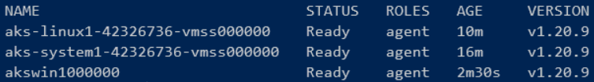
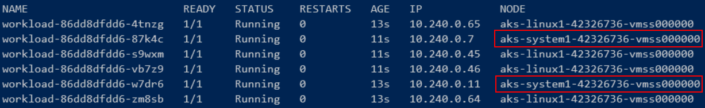
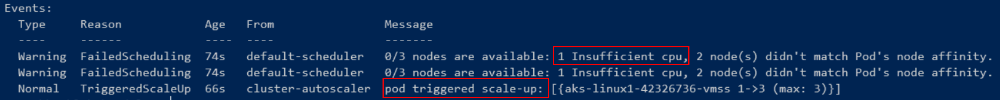
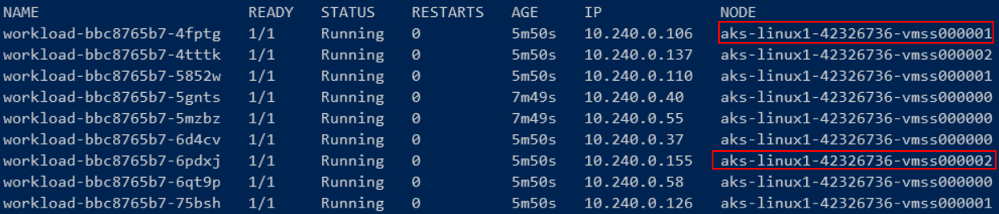
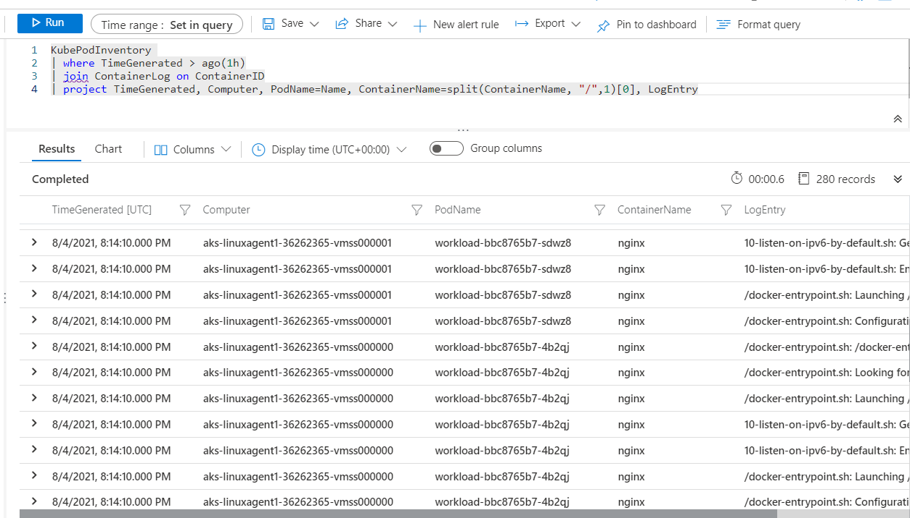

# Lab Module 2: Azure Kubernetes Service


> Estimated Duration: 60 minutes

# Module 2 Table of Contents

[Exercise: Create Supporting Resources](#exercise-create-supporting-resources)

[Exercise: Create ACR and Sample Workload Image](#exercise-create-acr-and-sample-workload-image)

[Exercise: Create AKS Cluster Using Azure CLI](#exercise-create-aks-cluster-using-azure-cli)

[Exercise: Create AKS Cluster Using Terraform](#exercise-create-aks-cluster-using-terraform)

[Exercise: Deploying Workloads to Nodes](#exercise-deploying-workloads-to-nodes)

[Exercise: Scaling Nodes to Meet Demand](#exercise-scaling-nodes-to-meet-demand)

[Exercise: Examine Container Insights](#exercise-examine-container-insights)

[Exercise: Cleanup Resources](#exercise-cleanup-resources)

# Exercise: Create Supporting Resources

### Task 1 - Connect to Azure Subscription and Install Required Providers

1. Open a Windows Terminal window (defalts to bash).


> Windows Terminal allows you to open tabbed command terminals.

2. Login to Azure.

```bash
az login
```

3. Set the current subscription.

```bash
az account set --subscription "Azure Pass - Sponsorship"
```

4. Register needed providers (if not performed in Lab 1).

```bash
az provider register --namespace Microsoft.Storage
az provider register --namespace Microsoft.Compute
az provider register --namespace Microsoft.Network
az provider register --namespace Microsoft.Monitor
az provider register --namespace Microsoft.ManagedIdentity
az provider register --namespace Microsoft.OperationalInsights
az provider register --namespace Microsoft.OperationsManagement
az provider register --namespace Microsoft.KeyVault
az provider register --namespace Microsoft.ContainerService
az provider register --namespace Microsoft.Kubernetes
```

5. Open a browser and navigate to the Azure Portal: **_portal.azure.com_**

6. Search for and open the **Subscriptions** blade. Select your **Azure Pass - Sponsorship** subscription.

7. Scroll down and select **Resource providers**.


8. Watch the progress of the registration process until all the providers listed above have been registered. Click the _Refresh_ button every few minutes to update the progess. Once everything has been registered, continue with the tasks in this lab.

### Task 2 - Define global variables and create resource group

1. Select the region closest to your location. Use '**eastus**' for United States workshops, '**switzerlandnorth**' for European workshops. Ask your instructor for other options in your region: @lab.DropDownList(region)[eastus,westus,canadacentral,switzerlandnorth,centralindia,australiaeast]

2. Set your initials (update as needed).

```bash
YOUR_INITIALS="AK"
```

3. Set global variables

```bash
INITIALS="$($YOUR_INITIALS)".ToLower()
RESOURCE_GROUP="azure-$($INITIALS)-rg"
LOCATION="@lab.Variable(region)"
```

4. Create Resource Group.

```bash
az group create --location $LOCATION  --resource-group $RESOURCE_GROUP
```

5. Get list of available VM sizes with 2 cores in your region.

```bash
az vm list-sizes --location $LOCATION --query "[?numberOfCores == ``2``].{Name:name}" -o table
```

6. Set the VM SKU to one of the available values

```bash
VM_SKU="Standard_D2as_v5"
```

### Task 3 - Create managed identies

1. Define identity names:

- **AKS Identity** - Used by AKS control plane components to manage cluster resources including ingress load balancers and AKS-managed public IPs, Cluster Autoscaler, Azure Disk, File, Blob CSI drivers
- **Kubelet Identity** - For authentication with Azure Container Registry (ACR). Needs to have **AcrPull** role assigned.

```bash
AKS_IDENTITY="aks-identity-$($INITIALS)"
KUBELET_IDENTITY="kubelet-identity-$($INITIALS)"
```

2. Create User Managed Identities

```bash
AKS_IDENTITY_ID=$(az identity create `
    --name $AKS_IDENTITY `
    --resource-group $RESOURCE_GROUP `
    --query id -o tsv)

KUBELET_IDENTITY_ID=$(az identity create `
    --name $KUBELET_IDENTITY `
    --resource-group $RESOURCE_GROUP `
    --query id -o tsv)
```

3. Verify settings

```bash
echo "AKS Identity ID: $AKS_IDENTITY_ID"
echo "Kubelet Identity ID: $KUBELET_IDENTITY_ID"
```

### Task 4 - Create VNet and Subnets and associate with NSG

1. Define VNET.
   > Usable Host IP Range: **10.200.0.1 - 10.200.255.250**
   > Usable Hosts: 65530

```bash
AKS_VNET_NAME="aks-$($INITIALS)-vnet"
AKS_VNET_ADDRESS_PREFIX="10.200.0.0/16"
```

2. Define a subnet for nodes.
   > Usable Host IP Range: **10.200.4.1 - 10.200.7.250**
   > Usable Hosts: 1019

```bash
NODES_SUBNET_NAME="aks-$($INITIALS)-nodes-subnet"
NODES_SUBNET_PREFIX="10.200.4.0/22"
```

3. Define a subnet for Pods. Used for dynamic IP allocation.
   > Usable Host IP Range: **10.200.128.1 - 10.200.255.250**
   > Usable Hosts: 32760

```bash
PODS_SUBNET_NAME="aks-$($INITIALS)-pods-subnet"
PODS_SUBNET_PREFIX="10.200.128.0/17"
```

4. Create an Azure Virtual Network and subnets. Nodes subnet is created with the VNet because all VNets require at least one subnet. Then the second subnet is created.

```bash
az network vnet create --resource-group $RESOURCE_GROUP `
                      --name $AKS_VNET_NAME `
                      --address-prefix $AKS_VNET_ADDRESS_PREFIX `
                      --subnet-name $NODES_SUBNET_NAME `
                      --subnet-prefix $NODES_SUBNET_PREFIX

az network vnet subnet create --resource-group $RESOURCE_GROUP `
                      --vnet-name $AKS_VNET_NAME `
                      --name $PODS_SUBNET_NAME `
                      --address-prefixes $PODS_SUBNET_PREFIX
```

5. Get vnet and subnet ids

```bash
AKS_VNET_ID=$(az network vnet show `
                --resource-group $RESOURCE_GROUP `
                --name $AKS_VNET_NAME `
                --query id -o tsv)

NODES_SUBNET_ID=$(az network vnet subnet show `
                --resource-group $RESOURCE_GROUP `
                --vnet-name $AKS_VNET_NAME `
                --name $NODES_SUBNET_NAME --query id -o tsv)

PODS_SUBNET_ID=$(az network vnet subnet show `
                --resource-group $RESOURCE_GROUP `
                --vnet-name $AKS_VNET_NAME `
                --name $PODS_SUBNET_NAME `
                --query id -o tsv)
```

6. Verify settings

```bash
echo "VNet ID: $AKS_VNET_ID"
echo "Nodes Subnet ID: $NODES_SUBNET_ID"
echo "Pods Subnet ID: $PODS_SUBNET_ID"
```

7. Create Network Security Group (NSG)

```bash
NSG_NAME="aks-$($INITIALS)-nsg"
NSG_ID=$(az network nsg create `
            --resource-group $RESOURCE_GROUP `
            --name $NSG_NAME `
            --query id -o tsv)
```

8. Associate NSG to subnets

```bash
az network vnet subnet update `
            --resource-group $RESOURCE_GROUP `
            --name $NODES_SUBNET_NAME `
            --vnet-name $AKS_VNET_NAME `
            --network-security-group $NSG_NAME

az network vnet subnet update `
            --resource-group $RESOURCE_GROUP `
            --name $PODS_SUBNET_NAME `
            --vnet-name $AKS_VNET_NAME `
            --network-security-group $NSG_NAME
```

9. Verify NSG associations

```bash
az network vnet subnet show `
                --resource-group $RESOURCE_GROUP `
                --vnet-name $AKS_VNET_NAME `
                --name $NODES_SUBNET_NAME `
                --query networkSecurityGroup.id -o tsv

az network vnet subnet show `
                --resource-group $RESOURCE_GROUP `
                --vnet-name $AKS_VNET_NAME `
                --name $PODS_SUBNET_NAME `
                --query networkSecurityGroup.id -o tsv
```

These queries should return the resource ID of the NSG.

### Task 5 - Create a Log Analytics Workspace

1. Create a Log Analytics Workspace.

```bash
LOG_ANALYTICS_WORKSPACE_NAME="aks-$($INITIALS)-law"
LOG_ANALYTICS_WORKSPACE_RESOURCE_ID=$(az monitor log-analytics workspace create `
                --resource-group $RESOURCE_GROUP `
                --workspace-name $LOG_ANALYTICS_WORKSPACE_NAME `
                --query id -o tsv)
echo "Log Analytics Workspace Resource ID: $LOG_ANALYTICS_WORKSPACE_RESOURCE_ID"
```

[Module 2 Table of Contents](#module-2-table-of-contents)

[List of Modules](#modules-list)

# Exercise: Create ACR and Sample Workload Image

In this exercise you'll create an Azure Container Registry (ACR) and then use it to build a sample workload image.

### Task 1 - Create an Azure Container Registry

1. Define ACR name.

> NOTE: ACR name must be globally unique.

```bash
SUFFIX=(Get-Date -Format "MMddyy")
ACR_NAME="acr$($INITIALS)$($SUFFIX)"
echo "ACR Name: $ACR_NAME"
```

> **Take note of this name! You will need it when updating the image name in your manifests.**

2. Create an Azure Container Registry (ACR)

```bash
ACR_ID=$(az acr create --resource-group $RESOURCE_GROUP `
              --name $ACR_NAME `
              --sku Standard `
              --workspace $LOG_ANALYTICS_WORKSPACE_RESOURCE_ID `
              --query id -o tsv)
```

3. Verify settings

```bash
echo "ACR ID: $ACR_ID"
```

### Task 2 - Use ACR to build image

1. Login to ACR to not use Docker (using the *--expose-token* option)

```bash
az acr login --name $ACR_NAME --expose-token
```

2. Define image name and source files location

```bash
SAMPLE_IMAGE_NAME="mt3-chained-web:latest"
SOURCE_FOLDER="c:/k8s/labs/MathTrick/Chained/MT3Chained-Web/"
```

3. Build sample image.  Pushing the image is done automatically since the image already in the ACR after its built.

```bash
az acr build --registry $ACR_NAME `
          --resource-group $RESOURCE_GROUP `
          --file $SOURCE_FOLDER/Dockerfile `
          --image $SAMPLE_IMAGE_NAME `
          $SOURCE_FOLDER
```

4. Verify the image is in the registry

```bash
az acr repository list --name $ACR_NAME -o table
```


5. Get the full qualified image name

```bashe
echo "Workload Image name: $($ACR_NAME).azurcr.io/$($SAMPLE_IMAGE_NAME)"
```

6. Edit the **workload.yaml** file (line 18) and replace the current image name with the full name of the image you built and pushed.


[Module 2 Table of Contents](#module-2-table-of-contents)

[List of Modules](#modules-list)


# Exercise: Create AKS Cluster Using Azure CLI

In this exercise you will create an AKS cluster using the Azure Command-line Interface (CLI).

**You should complete this exercise **OR** the [Exercise: Create AKS Cluster Using Terraform](#exercise-create-aks-cluster-using-terraform), **NOT BOTH!****

### Task 1 - Create an AKS Cluster with a System Node Pool

1. Use all the prior settings and resources to create the AKS cluster. Please review the parameters of the command below.

```bash
AKS_NAME="aks-$($INITIALS)"
echo "AKS Cluster Name: $AKS_NAME"
```

**NOTE:** See Microsoft reference: https://docs.microsoft.com/en-us/cli/azure/aks?view=azure-cli-latest#az_aks_create

> This step will take 5-10 minutes to complete.

```bash
az aks create --resource-group $RESOURCE_GROUP `
              --name $AKS_NAME `
              --generate-ssh-keys `
              --enable-managed-identity `
              --assign-identity $AKS_IDENTITY_ID `
              --assign-kubelet-identity $KUBELET_IDENTITY_ID `
              --attach-acr $ACR_ID `
              --node-count 1 `
              --enable-cluster-autoscaler `
              --min-count 1 `
              --max-count 3 `
              --network-plugin azure `
              --vnet-subnet-id $NODES_SUBNET_ID `
              --pod-subnet-id $PODS_SUBNET_ID `
              --node-vm-size $VM_SKU `
              --nodepool-name system1 `
              --enable-addons monitoring `
              --workspace-resource-id $LOG_ANALYTICS_WORKSPACE_RESOURCE_ID `
              --zones 1 2 3 `
              --enable-ahub
```

2. Once the cluster is ready (after at least 5 minutes), connect your local machine to it.

```bash
az aks get-credentials --name $AKS_NAME --resource-group $RESOURCE_GROUP
```

3. List the nodes in the cluster. There should be **1** node to start with.

```bash
kubectl get nodes -o wide
```

> Notice the Node's IP address is from the **10.200.4.xx** subnet


4. Get a list of all the pods in the cluster, with their IPs

```bash
kubectl get pods -A -o wide
```


> Notice most of the pods are using IPs from the **10.200.128.xx** subnet, while others do not need their own IP address (because they will never be accessed), so are using their node's IP instead. This is accomplished by setting the **hostNetwork** property of the **PodSpec** to <u>true</u>.

5. Get the list of system nodes only. At this point, the list should return **1** node.

```bash
kubectl get nodes -l="kubernetes.azure.com/mode=system"
```

6. List the node pools in the cluster. There should be 1 node pool returned.

```bash
az aks nodepool list --cluster-name $AKS_NAME --resource-group $RESOURCE_GROUP -o table
```


### Task 5 - Create a Linux User Node Pool

1. Create a Linux user node pool.

```bash
az aks nodepool add --resource-group $RESOURCE_GROUP `
                    --cluster-name $AKS_NAME `
                    --os-type Linux `
                    --name linux1 `
                    --node-count 1 `
                    --enable-cluster-autoscaler `
                    --min-count 1 `
                    --max-count 3 `
                    --mode User `
                    --pod-subnet-id $PODS_SUBNET_ID `
                    --node-vm-size $VM_SKU
```

2. List the nodes in the cluster. There should be 2 nodes now.

```bash
kubectl get nodes
```

3. Get the list of system nodes only. There should still be only 1 system node.

```bash
kubectl get nodes -l="kubernetes.azure.com/mode=system"
```

4. List the node pools in the cluster. Again there should be 2 now.

```bash
az aks nodepool list --cluster-name $AKS_NAME --resource-group $RESOURCE_GROUP -o table
```


### Task 6 - Create a Windows User Node Pool

1. Create a Windows user node pool.

```bash
az aks nodepool add --resource-group $RESOURCE_GROUP `
                    --cluster-name $AKS_NAME `
                    --os-type Windows `
                    --name win1 `
                    --node-count 1 `
                    --mode User `
                    --pod-subnet-id $PODS_SUBNET_ID `
                    --node-vm-size $VM_SKU
```

2. List the nodes in the cluster. There should be 3 nodes.

```bash
kubectl get nodes
```



3. Get the list of system nodes only. There should still be only 1 node.

```bash
kubectl get nodes -l="kubernetes.azure.com/mode=system"
```

4. Get the list of Linux nodes. There should be 2 nodes.

```bash
kubectl get nodes -l="kubernetes.io/os=linux"
```

5. List the node pools in the cluster. Again there should be 3.

```bash
az aks nodepool list --cluster-name $AKS_NAME --resource-group $RESOURCE_GROUP -o table
```


### Task 7 - Adjust the Auto Scaler for the lab

The default settings for the AKS Auto Scaler are tuned for production environments, but take too long to scale up/down during demos and practice labs.

1. Configure the cluster-wide auto scaling profile so all the node pool auto scalers are more responsive.

```bash
az aks update --resource-group $RESOURCE_GROUP `
              --name $AKS_NAME `
              --cluster-autoscaler-profile `
                  scale-down-delay-after-add=1m `
                  scale-down-unready-time=1m `
                  scale-down-unneeded-time=1m `
                  skip-nodes-with-system-pods=true
```

**NOTE:** Refer to this link for a complete description of the options available: [AKS Cluster Autoscaler](https://docs.microsoft.com/en-us/azure/aks/cluster-autoscaler)

[Module 2 Table of Contents](#module-2-table-of-contents)

[List of Modules](#modules-list)


# Exercise: Create AKS Cluster Using Terraform

In this exercise you will create an AKS cluster using the Terraform utility by HashiCorp.

You should complete this exercise **OR** the [Exercise: Create AKS Cluster Using Azure CLI](#exercise-create-aks-cluster-using-azure-cli), **NOT BOTH!**

### Task 1 - Ensure resource names are unique

1. Open a Windows Terminal window (defaults to bash).


2. Login to Azure.

```bash
az login
```

4. Define variables.

```bash
INITIALS="AK"
```

```bash
INITIALS="$($INITIALS)".ToLower()
$env:TF_VAR_RESOURCE_GROUP="azure-$($INITIALS)-rg"
$env:TF_VAR_ACR="acr$($INITIALS)"
```

### Task 2 - Go to the Main Terraform folder and Initialize It

1. Open a Windows Terminal window (defaults to bash).

2. Change current folder to **Main**

```bash
$ROOT_PATH="C:\k8s\Labs\Module2\Terraform"
cd  C:\k8s\labs\Module2\Terraform\Main
```

3. To initialize the Terraform directory it is necessary the **main.tf** file that is already created in the **Main** folder.

```JavaScript
# We strongly recommend using the required_providers block to set the
# Azure Provider source and version being used
terraform {
  required_providers {
    azurerm = {
      source  = "hashicorp/azurerm"
      version = "=3.3.0"
    }
  }
}

# Configure the Microsoft Azure Provider
provider "azurerm" {
  features {}
}
```

4. Open a Terminal in VS Code and initialize the Terraform directory.

```bash
terraform init
```

### Task 3 - Create an Azure Resource Group

1. Add the following variable in the **rg_vars.tf** in the **Resources** folder to the **vars.tf** file in the **Main** folder. This code will use the environment variable defined earlier.

```JavaScript
variable "RESOURCE_GROUP" {
    type        = string
    description = "This is the rg name"
}
```

```bash
$From = Get-Content -Path (Join-Path $ROOT_PATH Resources\rg_vars.tf)
Add-Content -Path (Join-Path $ROOT_PATH Main\vars.tf) -Value $From
```

2. Move the file **rg.tf** in the **Resources** folder to the **Main** folder.

```JavaScript
resource "azurerm_resource_group" "arg" {
  name     = var.RESOURCE_GROUP
  location = "East US"
}
```

```bash
mv $ROOT_PATH/Resources/rg.tf $ROOT_PATH/Main
```

3. Have Terraform plan and apply your changes. Then this step finishes, you should have a new Resource Group available in the Azure Portal.

```bash
terraform plan
terraform apply -auto-approve
```

### Task 4 - Create an Azure Container Registry

1. Add the following variables in the **acr_vars.tf** in the **Resources** folder to the **vars.tf** file in the **Main** folder. This code will use the environment variables defined earlier.

```JavaScript
variable "ACR" {
  type        = string
  description = "This is the acr name"
}
```

```bash
$From = Get-Content -Path (Join-Path $ROOT_PATH Resources\acr_vars.tf)
Add-Content -Path (Join-Path $ROOT_PATH Main\vars.tf) -Value $From
```

2. Move the file **acr.tf** in the **Resources** folder to the **Main** folder.

```JavaScript
resource "azurerm_container_registry" "acr" {
  name                = var.ACR
  location            = "East US"
  resource_group_name = var.RESOURCE_GROUP
  sku                 = "Standard"
  admin_enabled       = false
}
```

```bash
Move-Item (Join-Path $ROOT_PATH Resources\acr.tf) -Destination (Join-Path $ROOT_PATH Main)
```

3. Have Terraform plan and apply your changes. Then this step finishes, you should have a new ACR available in the Azure Portal.

```bash
terraform plan
terraform apply -auto-approve
```

### Task 5 - Create a Virtual Network and a Subnet

1. Define variables.

```bash
$env:TF_VAR_AKS_VNET="aks-$($INITIALS)-vnet"
$env:TF_VAR_AKS_VNET_SUBNET="aks-$($INITIALS)-subnet"
$env:TF_VAR_AKS_VNET_ADDRESS_PREFIX='["10.0.0.0/8"]'
$env:TF_VAR_AKS_VNET_SUBNET_PREFIX="10.240.0.0/16"
```

2. Add the following variables in the **vnet_vars.tf** in the **Resources** folder to the end of the **vars.tf** file in the **Main** folder.

```JavaScript
variable "AKS_VNET" {
    type        = string
    description = "This is the vnet name"
}

variable "AKS_VNET_SUBNET" {
    type        = string
    description = "This is the subnet name"
}

variable "AKS_VNET_ADDRESS_PREFIX" {
    type        = list(string)
    description = "This is the vnet address prefix"
}

variable "AKS_VNET_SUBNET_PREFIX" {
    type        = string
    description = "This is the subnet address prefix"
}
```

```bash
$From = Get-Content (Join-Path $ROOT_PATH Resources\vnet_vars.tf)
Add-Content (Join-Path $ROOT_PATH Main\vars.tf) -Value $From
```

3. Move the file called **vnet.tf** in the **Resources** folder to the **Main** folder.

```JavaScript
resource "azurerm_virtual_network" "network" {
  name                = var.AKS_VNET
  location            = "West US 2"
  resource_group_name = var.RESOURCE_GROUP
  address_space       = var.AKS_VNET_ADDRESS_PREFIX

  subnet {
    name           = var.AKS_VNET_SUBNET
    address_prefix = var.AKS_VNET_SUBNET_PREFIX
  }
}
```

```bash
Move-Item (Join-Path $ROOT_PATH Resources\vnet.tf) -Destination (Join-Path $ROOT_PATH Main)
```

4. Have Terraform plan and apply your changes. When this step finishes, there will be a VNET created and ready to be used by your cluster.

```bash
terraform plan
terraform apply -auto-approve
```

### Task 6 - Create a Log Analytics Workspace

1. Define variables.

```bash
$env:TF_VAR_LOG_ANALYTICS_WORKSPACE_NAME="aks-$($INITIALS)-law"
```

2. Add the following variables in the **law_vars.tf** in the **Resources** folder to the end of the **vars.tf** file in the **Main** folder.

```JavaScript
variable "LOG_ANALYTICS_WORKSPACE_NAME" {
    type        = string
    description = "This is the law name"
}
```

```bash
$From = Get-Content (Join-Path $ROOT_PATH Resources\law_vars.tf)
Add-Content (Join-Path $ROOT_PATH Main\vars.tf) -Value $From
```

3. Move the file called **law.tf** in the **Resources** folder to the **Main** folder.

```JavaScript
resource "azurerm_log_analytics_workspace" "log_analytics" {
  name                = var.LOG_ANALYTICS_WORKSPACE_NAME
  location            = "West US 2"
  resource_group_name = var.RESOURCE_GROUP
  sku                 = "PerGB2018"
  retention_in_days   = "90"
}

resource "azurerm_log_analytics_solution" "log_analytics" {
  solution_name         = "ContainerInsights"
  location              = azurerm_log_analytics_workspace.log_analytics.location
  resource_group_name   = azurerm_log_analytics_workspace.log_analytics.resource_group_name
  workspace_resource_id = azurerm_log_analytics_workspace.log_analytics.id
  workspace_name        = azurerm_log_analytics_workspace.log_analytics.name

  plan {
    publisher = "Microsoft"
    product   = "OMSGallery/ContainerInsights"
  }
}
```

```bash
Move-Item (Join-Path $ROOT_PATH Resources\law.tf) -Destination (Join-Path $ROOT_PATH Main)
```

4. Have Terraform plan and apply your changes. When this step finishes, there will be a Log Analytics Workspace for your cluster to send telemetry to.

```bash
terraform plan
terraform apply -auto-approve
```

### Task 7 - Create an AKS Cluster

1. Use all the prior settings and resources to create the AKS cluster.

```bash
$env:TF_VAR_AKS_CLUSTER="aks-$($INITIALS)-tf"
```

2. Add the following variable in the **aks_vars.tf** in the **Resources** folder to the end of the **vars.tf** file in the **Main** folder.

```JavaScript
variable "AKS_CLUSTER" {
    type        = string
    description = "This is the aks name"
}
```

```bash
$From = Get-Content (Join-Path $ROOT_PATH Resources\aks_vars.tf)
Add-Content (Join-Path $ROOT_PATH Main\vars.tf) -Value $From
```

3. Move the file called **aks.tf** in the **Resources** folder to the **Main** folder.

```JavaScript
resource "azurerm_kubernetes_cluster" "aks" {

  name                 = var.AKS_CLUSTER
  location             = "East US"
  resource_group_name  = var.RESOURCE_GROUP
  dns_prefix           = var.AKS_CLUSTER
  azure_policy_enabled = true

  default_node_pool {
    name                = "systempool"
    node_count          = 1
    enable_auto_scaling = true
    min_count           = 1
    max_count           = 3
    vnet_subnet_id      = element(azurerm_virtual_network.network.subnet.*.id, 0)
    vm_size             = "Standard_D2as_v5"
    zones               = ["1"]
  }

  identity {
    type = "SystemAssigned"
  }

  oms_agent {
    log_analytics_workspace_id = azurerm_log_analytics_workspace.log_analytics.id
  }

  network_profile {
    network_plugin     = "azure"
    service_cidr       = "10.0.0.0/16"
    dns_service_ip     = "10.0.0.10"
    docker_bridge_cidr = "172.17.0.1/16"
  }
}

resource "azurerm_role_assignment" "aks_acr" {
  scope                = azurerm_container_registry.acr.id
  role_definition_name = "AcrPull"
  principal_id         = azurerm_kubernetes_cluster.aks.kubelet_identity[0].object_id
}
```

```bash
Move-Item (Join-Path $ROOT_PATH Resources\aks.tf) -Destination (Join-Path $ROOT_PATH Main)
```

4. Have Terraform plan and apply your changes. This step will take 5-10 minutes to complete.

```bash
terraform plan
terraform apply -auto-approve
```

5. Once the cluster is ready, connect your local machine to it.

```bash
az aks get-credentials --name $env:TF_VAR_AKS_CLUSTER --resource-group $env:TF_VAR_RESOURCE_GROUP
```

6. List the nodes in the cluster. There should be 1 nodes to start with.

```bash
kubectl get nodes
```

### Task 8 - Create a Linux User Node Pool

1. Create a Linux user node pool, add this code from the **aks_linux_node_pool.tf** in the **Resources** folder to the bottom of the **aks.tf** file.

```JavaScript
resource "azurerm_kubernetes_cluster_node_pool" "linuxnp" {
  name                  = "linuxagent1"
  kubernetes_cluster_id = azurerm_kubernetes_cluster.aks.id
  os_type               = "Linux"
  node_count            = 1
  enable_auto_scaling   = true
  min_count             = 1
  max_count             = 3
  mode                  = "User"
  vm_size               = "Standard_D2as_v5"
  zones                 = ["1"]
  vnet_subnet_id        = element(azurerm_virtual_network.network.subnet.*.id, 0)
}
```

```bash
$From = Get-Content (Join-Path $ROOT_PATH Resources\aks_linux_node_pool.tf)
Add-Content (Join-Path $ROOT_PATH Main\aks.tf) -Value $From
```

2. Have Terraform plan and apply your changes.

```bash
terraform plan
terraform apply -auto-approve
```

3. List the nodes in the cluster. There should be 2 nodes now.

```bash
kubectl get nodes
```

### Task 9 - Create a Windows User Node Pool

1. Create a Windows user node pool, add this code from the **aks_windows_node_pool.tf** in the **Resources** folder to the bottom of the **aks.tf** file.

```JavaScript
resource "azurerm_kubernetes_cluster_node_pool" "winnp" {
  name                  = "win1"
  kubernetes_cluster_id = azurerm_kubernetes_cluster.aks.id
  os_type               = "Windows"
  node_count            = 1
  enable_auto_scaling   = true
  min_count             = 1
  max_count             = 3
  mode                  = "User"
  vm_size               = "Standard_D2as_v5"
  zones                 = ["1"]
  vnet_subnet_id        = element(azurerm_virtual_network.network.subnet.*.id, 0)
}
```

```bash
$From = Get-Content (Join-Path $ROOT_PATH Resources\aks_windows_node_pool.tf)
Add-Content (Join-Path $ROOT_PATH Main\aks.tf) -Value $From
```

2. Have Terraform plan and apply your changes.

```bash
terraform plan
terraform apply -auto-approve
```

3. List the nodes in the cluster. There should be 3 nodes.

```bash
kubectl get nodes
```

### Task 10 - Create the Diagnostic Settings Module

1. Define variables.

```bash
$env:TF_VAR_DIAGNOSTIC_SETTING_NAME="ds-$($INITIALS)"
```

2. Add the following variable in the **ds_vars.tf** in the **Resources** folder to the end of the **vars.tf** file in the **Main** folder.

```JavaScript
variable "DIAGNOSTIC_SETTING_NAME" {
    type        = string
    description = "This is the ds name"
}
```

```bash
$From = Get-Content (Join-Path $ROOT_PATH Resources\ds_vars.tf)
Add-Content (Join-Path $ROOT_PATH Main\vars.tf) -Value $From
```

3. Move the file called **ds.tf** in the **Resources** folder to the **Main** folder.

```JavaScript
resource "azurerm_monitor_diagnostic_setting" "diagnostic_logs" {
  name               = var.DIAGNOSTIC_SETTING_NAME
  target_resource_id = azurerm_kubernetes_cluster.aks.id
  storage_account_id = azurerm_storage_account.storage.id

  dynamic "log" {
    for_each = ["kube-apiserver", "kube-controller-manager", "cluster-autoscaler", "kube-scheduler", "kube-audit", "kube-audit-admin", "guard"]
    content {
      category = log.value
      enabled  = true

      retention_policy {
        enabled = true
        days    = 30
      }
    }
  }

  metric {
    category = "AllMetrics"
    enabled  = true

    retention_policy {
      days    = 30
      enabled = true
    }
  }
}
```

```bash
Move-Item (Join-Path $ROOT_PATH Resources\ds.tf) -Destination (Join-Path $ROOT_PATH Main)
```

### Task 11 - Create the Storage Account Module for the Diagnostic Settings

1. Define variables.

```bash
$env:TF_VAR_STORAGE_ACCOUNT_NAME="sa$($INITIALS)"
```

2. Add the following variable in the **sa_vars.tf** in the **Resources** folder to the end of the **vars.tf** file in the **Main** folder.

```JavaScript
variable "STORAGE_ACCOUNT_NAME" {
    type        = string
    description = "This is the sa name"
}
```

```bash
$From = Get-Content (Join-Path $ROOT_PATH Resources\sa_vars.tf)
Add-Content (Join-Path $ROOT_PATH Main\vars.tf) -Value $From
```

3. Move the file called **sa.tf** in the **Resources** folder to the **Main** folder.

```JavaScript
resource "azurerm_storage_account" "storage" {
  name                      = var.STORAGE_ACCOUNT_NAME
  location                  = "West US 2"
  resource_group_name       = var.RESOURCE_GROUP
  account_kind              = "StorageV2"
  account_tier              = "Standard"
  account_replication_type  = "LRS"
  access_tier               = "Hot"
  enable_https_traffic_only = true
}
```

```bash
Move-Item (Join-Path $ROOT_PATH Resources\sa.tf) -Destination (Join-Path $ROOT_PATH Main)
```

4. Have Terraform plan and apply your changes.

```bash
terraform plan
terraform apply -auto-approve
```

### Task 12 - Adjust the Auto Scaler for the lab

1. The default settings for the AKS Auto Scaler are tuned for production environments, but take too long to scale up/down during demos and practice labs.
2. Configure the cluster-wide auto scaling profile so all the node pool auto scalers are more responsive. Add the following code inside the resource **"azurerm_kubernetes_cluster" "aks" {}** module, for example, below the **default_node_pool {}**. For this purpouse replace **aks.tf** file in the **Main** folder with the content of **aks2.tf** in the **Resources** folder.

```JavaScript
  auto_scaler_profile {
    scale_down_unneeded         = "1m"
    scale_down_delay_after_add  = "1m"
    scale_down_unready          = "1m"
    skip_nodes_with_system_pods = true
  }
```

```bash
Get-Content (Join-Path $ROOT_PATH Resources\aks2.tf) | Set-Content (Join-Path $ROOT_PATH Main\aks.tf)
```

3. Have Terraform plan and apply your changes.

```bash
terraform plan
terraform apply -auto-approve
```

[Module 2 Table of Contents](#module-2-table-of-contents)

[List of Modules](#modules-list)

# Exercise: Deploying Workloads to Nodes

In this exercise you will deploy different pods to various node pools in your cluster.

### Task 1 - Deploy a simple workload with no Node Selector

1. Change current folder to **Module2**

```bash
cd  C:\k8s\labs\Module2
```

2. Deploy a workload with 6 replicas and no _Node Selector_.

```bash
kubectl apply -f workload.yaml
```

3. Get a complete list of all pods and review the results.

```bash
kubectl get pods -o wide
```


**NOTE:** Notice some of the pods got created on the Linux nodes, while others got scheduled on the Windows nodes, and thus could not be run. The Linux image specified in the Deployment is not compatible with the Windows 2019 OS running on the Windows nodes.

4. Describe any of the failed pods to see the actual error.

```bash
kubectl describe pod <failed pod name>
```


**NOTE:** Without any guidance, the Kubernetes scheduler does its best to distribute workloads evenly across all the nodes that have available resources. It doesn't examine the contents of Deployments to confirm that their images are compatible with the nodes it selects.

5. Update the **workload.yaml** file to add the following node selector:

```yaml
nodeSelector:
  kubernetes.io/os: linux
```


6. Apply the deployment again and list the pods.

```bash
kubectl apply -f workload.yaml
kubectl get pods -o wide
```

**NOTE:** It will take a few seconds for the bad pods to be deleted, so they may show as **Terminated** for little some time.



> Notice that all the pods are running now, but they're spread across both the system and user nodes. The reason for creating user nodes is to seprate your workloads from system utilities.

7. Update the **workload.yaml** file to add an additional label "**kubernetes.azure.com/mode: user**" to the Node Selector. The final _nodeSelector_ section should look like this:

```yaml
nodeSelector:
  kubernetes.io/os: linux
  kubernetes.azure.com/mode: user
```

8. Apply the deployment again and list the pods.

```bash
kubectl apply -f workload.yaml
kubectl get pods -o wide
```


**PERFECT!**

[Module 2 Table of Contents](#module-2-table-of-contents)

[List of Modules](#modules-list)

# Exercise: Scaling Nodes to Meet Demand

In this exercise you'll watch how the AKS Auto Scaler adjusts the number of nodes based on increased demand and then scales them back down when the load is reduced.

### Task 1 - Verify the names and number of current nodes

1. Get a list of the Linux user nodes.

```bash
kubectl get nodes -l="kubernetes.azure.com/mode=user,kubernetes.io/os=linux"
```

### Task 2 - Increase the number of replicas to trigger the Auto Scaler to scale up

1. Increase the number of replicas to force the Auto Scaler to create more nodes in the Linux user node pool.

```bash
kubectl scale --replicas=40 deploy/workload
```

2. Get the list of pods.

```bash
kubectl get pods -o wide
```

> Notice that some pods are **Pending** state.


3. Describe one of the Pending pods

```bash
kubectl describe pod <pending pod name>
```

> Notice that the Events section describes the problem and the solution.



4. Start a watch on the nodes

```bash
kubectl get nodes -l="kubernetes.azure.com/mode=user,kubernetes.io/os=linux" -w
```

In a few minutes you'll see the number of nodes increase.


5. When the new nodes are in a **Ready** state, press _Ctrl-C_ to break out of the watch and return to the console.
6. Get a list of pods.

```bash
kubectl get pods -o wide
```

> Notice all the pening Pods are running and they're all in the same node pool, scheduled on the new nodes.



### Task 3 - Reduce workload to trigger the Auto Scaler to scale down

1. Delete the workload.

```bash
kubectl delete deploy/workload
```

2. Watch the nodes

```bash
kubectl get nodes -l="kubernetes.azure.com/mode=user,kubernetes.io/os=linux" -w
```

**NOTE:** In a few minutes, two of the nodes will go into a **NotReady** state and then disappear. It will probably _NOT_ be both the new nodes that were created. The "victim" nodes are picked using an internal scale-in policy.


**NOTE:** The cluster autoscaler may be unable to scale down if pods can't be deleted, such as in the following situations:

- A pod is directly created and isn't backed by a controller object, such as a deployment or replica set.

- A pod disruption budget (PDB) is too restrictive and doesn't allow the number of pods to be fall below a certain threshold.

- A pod uses node selectors or anti-affinity that can't be honored by other nodes when the replacement Pod is scheduled.

3. Break out of the watch and keep getting the list of nodes manually. Repeat the command below until there is only 1 node left.

```bash
kubectl get nodes -l="kubernetes.azure.com/mode=user,kubernetes.io/os=linux"
```


[Module 2 Table of Contents](#module-2-table-of-contents)

[List of Modules](#modules-list)

# Exercise: Examine Container Insights

Now that you've used your cluster for a little while, you should have some metrics and logs in Container Insights to review.

### Task 1 - Review Container Insights

1. Open the Azure Portal in a browser.
2. Search for "Kubernetes". Click on your cluster.
3. Scroll down to **Insights** on the option blade.
4. Navigate through the various tabs.

**Cluster metrics overview:**


**Nodes list:**


**Containers:**


5. Scroll down to **Logs** on the option blade.
6. Copy this query into the editor and click **Run**

```kql
KubePodInventory
| where TimeGenerated > ago(1h)
| join ContainerLog on ContainerID
| project TimeGenerated, Computer, PodName=Name, ContainerName=split(ContainerName, "/",1)[0], LogEntry
```



You'll see how the container logs are sent to a Log Analytics Workspace for analysis.

### Sample Kusto Queries for Container Insights

The link below list some common Kusto queries for Container Insights data:

https://docs.microsoft.com/en-us/azure/azure-monitor/containers/container-insights-log-query

[Module 2 Table of Contents](#module-2-table-of-contents)

[List of Modules](#modules-list)

# Exercise: Cleanup Resources

### Task 1 - Delete the cluster and its resources - Azure CLI

When you're done working with the cluster, you can delete it. You have the complete instructions here on how to recreate it.

It's a good idea to repeat this lab several times, changing some of the settings, in order to get the hang of working with AKS clusters.

1. Deleting the cluster is much easier than creating it.

```bash
az aks delete --resource-group $RESOURCE_GROUP --name $AKS_NAME
```

2. You can skip deleting these resources if you're planning on recreating just the cluster at a later time.

3. Delete the Log Analytics Workspace.

```bash
az monitor log-analytics workspace delete --resource-group $RESOURCE_GROUP --workspace-name $LOG_ANALYTICS_WORKSPACE_NAME
```

4. Delete the Virtual Network

```bash
az network vnet delete --resource-group $RESOURCE_GROUP --name $AKS_VNET
```

**HINT: You could go through and delete individual resources above or you could delete the ENTIRE resource group, which will delete everything in it. Only do this if you place to recreate all the supporting resources**

5. Delete the entire resource group

```bash
az group delete --resource-group $RESOURCE_GROUP
```

### Task 2 - Delete the cluster and its resources - Terraform

1. If you used Terraform to create your cluster, you can delete the cluster and all it supporting resources with the following command:

```bash
terraform destroy -auto-approve
```

[List of Modules](#modules-list)
